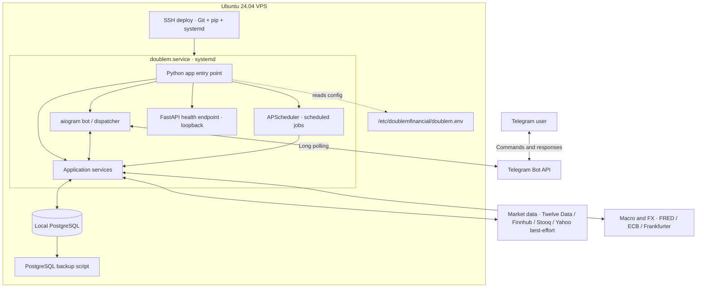

# DoubleM Financial

Telegram-first, self-hosted portfolio and market-risk assistant. Python, PostgreSQL and systemd. No web frontend, container runtime, Coolify or brokerage execution is required.

## Included

- Telegram commands for a manually maintained portfolio, quotes, macro data, refresh and status.
- PostgreSQL persistence for holdings, current quotes and macro metrics.
- Optional connectors: FRED, Twelve Data and Finnhub. Provider failures are classified, transient failures receive bounded retries, and previous valid data is retained when a refresh cannot obtain a new value.
- Free fallback for daily closes of explicitly allowlisted US tickers via Stooq, plus Frankfurter as an unauthenticated FX fallback to the ECB.
- ISIN-to-listed-symbol mapping for selected UCITS ETFs. Provider coverage is checked at runtime; unknown ISINs are not sent as exchange tickers.
- Daily risk-feature foundation. Probabilities remain disabled until a model is trained and validated walk-forward.
- Native Ubuntu deployment with systemd, SSH-based updates, journald logs and PostgreSQL backups.
- Docker Compose remains available only as an optional legacy/local deployment; it is not used by the SSH installation.
- No automated trading, order submission or portfolio rebalancing.

## Deploy on an Ubuntu 24.04 VPS over SSH

Connect to the VPS as a sudo-capable user. The installer requires root privileges and installs Python, PostgreSQL and Git. It creates a dedicated `doublem` system user, a local PostgreSQL database, a Python virtual environment and a systemd unit. It does not install Coolify, Docker, a web server or expose an inbound port.

```bash
sudo apt-get update
sudo apt-get install -y git
sudo git clone --branch main https://github.com/lmworkod/doubleMfinancial.git /opt/doublemfinancial
sudo bash /opt/doublemfinancial/scripts/install-ubuntu.sh
```

Edit the environment file on the VPS (do not commit or share it):

```bash
sudo nano /etc/doublemfinancial/doublem.env
```

Set at least:
- `TELEGRAM_BOT_TOKEN`: token from [@BotFather](https://t.me/BotFather).
- `TELEGRAM_ALLOWED_USER_IDS`: your numeric Telegram user ID(s), comma-separated. All users are denied when empty.
- `DATABASE_URL`: keep the local socket URL created by the installer unless you intentionally use another database.
- `FRED_API_KEY`: optional free key for macro data.
- `TWELVE_DATA_API_KEY`, `FINNHUB_API_KEY`: optional market sources.

The installer creates the service but does not start it until credentials are configured. Then run:

```bash
sudo systemctl start doublem
sudo systemctl status doublem --no-pager
sudo journalctl -u doublem -n 100 --no-pager
```

## SSH operations

```bash
# Follow logs
sudo journalctl -u doublem -f

# Restart / stop / start
sudo systemctl restart doublem
sudo systemctl stop doublem
sudo systemctl start doublem

# Check service and PostgreSQL
sudo systemctl is-active doublem
sudo systemctl is-active postgresql

# Deploy latest main (fast-forward only, installs dependencies and restarts)
sudo bash /opt/doublemfinancial/scripts/deploy.sh

# Back up PostgreSQL to /var/backups/doublemfinancial
sudo bash /opt/doublemfinancial/scripts/backup.sh
```

The deployment script refuses to proceed if the working tree has local modifications and uses `git pull --ff-only`. It does not delete data or perform destructive database migrations. Take a backup before upgrades and test restoration periodically. For a manual rollback, check out a known-good commit and reinstall it before restarting the service.

## Architecture

The production SSH installation runs natively on Ubuntu under systemd. The Python entry point initializes PostgreSQL, starts a loopback-only health endpoint and APScheduler, then starts the Telegram bot using long polling. The bot and scheduled jobs use the shared services layer, which coordinates persistence and market/macro data providers.



### Component responsibilities

1. **Telegram interface:** `aiogram` receives updates through outbound long polling and dispatches commands. Access is restricted by `TELEGRAM_ALLOWED_USER_IDS`; an empty allowlist denies all users.
2. **Application services:** coordinate portfolio operations, market-data refreshes, macro data and persistence.
3. **Scheduled jobs:** APScheduler runs recurring jobs inside the application process and reuses the services layer.
4. **Data providers:** configured market and macro providers supply quotes, daily observations and reference rates. Coverage, quotas, timestamps and entitlements vary by provider. Failed refreshes retain the last valid value and mark it stale rather than replacing it with zero.
5. **Persistence:** local PostgreSQL stores holdings, quotes and macro metrics.
6. **Health and operations:** the health endpoint is loopback-only. systemd supervises the application; journald stores its logs. The backup script backs up PostgreSQL.

### Production VPS configuration

The supported SSH deployment is a native systemd service. Docker Compose is an optional legacy/local configuration and is **not** the active production deployment.

| Item | Configuration |
|---|---|
| Repository | `/opt/doublemfinancial` |
| Branch | `main` |
| Service user | `doublem` |
| systemd service / unit | `doublem.service` |
| Unit file | `/etc/systemd/system/doublem.service` |
| Working directory | `/opt/doublemfinancial` |
| Virtual environment | `/opt/doublemfinancial/.venv` |
| Entry point | `/opt/doublemfinancial/.venv/bin/python -m app` |
| Environment file | `/etc/doublemfinancial/doublem.env` |
| Database service | `postgresql.service` |
| Logs | `journalctl -u doublem.service` |

The environment file contains secrets and must remain outside Git. Never print or share its contents.

### Ports and health checks

- Telegram uses outbound long polling and does not require a public inbound port.
- The health endpoint is intended for loopback access, not public exposure.
- Do not assume that port **8081** is listening; verify the configured application port and the actual socket.
- During a VPS check on 2026-09-28, `docker-proxy` was observed occupying `0.0.0.0:8080`, while application logs reported an `address already in use` error when binding `127.0.0.1:8080`. No listener on 8081 was observed at that time. This indicates a port conflict requiring investigation; it does not prove the health endpoint is available.
- Do not kill or restart an unidentified process to resolve a port conflict. The VPS also hosts unrelated Docker/Coolify workloads.

### Manual update of the existing SSH installation

If the deployment script cannot be used, this is the verified update sequence for the existing installation. The `sudo` Git commands are intentional because the Git index may be root-owned; dependencies are installed as the service account.

```bash
cd /opt/doublemfinancial
sudo git fetch origin
sudo git checkout main
sudo git pull --ff-only origin main
sudo -u doublem /opt/doublemfinancial/.venv/bin/pip install .
sudo systemctl restart doublem.service
```

Verify the service, recent logs and port separately:

```bash
sudo systemctl is-active doublem.service
sudo journalctl -u doublem.service -n 100 --no-pager
sudo ss -lntp | grep ':8081' || true
```

A successful package installation and an `active` systemd state do not, by themselves, prove that Telegram polling is healthy or that the HTTP health endpoint is listening. Review fresh logs and verify the relevant listener. Preserve port 8081 where intended, but confirm the application's configured port before diagnosing it.

**Do not run `docker compose up -d --build` or `docker compose down` to update the production SSH installation.** The production app is managed by systemd. Do not restart or modify Coolify or unrelated containers as part of an application update.

## Local development

```bash
cp .env.example .env
# Set credentials and a suitable DATABASE_URL
pip install -e '.[dev]'
ruff check .
pytest -q
```

## Telegram commands

`/start`, `/help`, `/portfolio`, `/add SYMBOL QUANTITY [AVERAGE_COST]`, `/remove SYMBOL`, `/analyze SYMBOL`, `/watchlist`, `/opportunities`, `/risk`, `/macro`, `/refresh`, `/status`.

Positions are entered manually; there is no broker connection. Valuation includes only positions with a stored quote that can be converted to EUR; cash and fees are excluded. USD positions use the latest stored ECB/Frankfurter USD-per-EUR reference rate.

## Instrument mapping

The database keeps the ISIN as the holding identifier; the market-data layer resolves supported ISINs to provider tickers. The mapping lives in `app/instruments.py`. Provider results are not guaranteed by the presence of a mapping: data coverage, symbol syntax and entitlements depend on each provider. Instruments without a verified mapping remain unavailable instead of being queried under an invalid ticker.

The current mapping includes First Trust Clean Smart Infrastructure (IE000J80JTL1, GRID), Global X Copper Miners (IE0003Z9E2Y3, COPX), Global X Silver Miners (IE000UL6CLP7, SILV), VanEck Space Innovators (IE000YU9K6K2, JEDI), WisdomTree Strategic Metals and Rare Earths Miners (IE000KHX9DX6, RARE), iShares Physical Gold ETC (IE00B4ND3602, PPFB on Xetra) and VanEck Uranium and Nuclear Technologies UCITS ETF (IE000M7V94E1, NUKL on Xetra). Only Twelve Data symbols are configured for these mapped ISINs. Finnhub's ordinary quote endpoint is used only for regular tickers; its international real-time data requires higher-tier access.

The Stooq fallback is deliberately restricted to SPY, QQQ and IWM and returns daily bars, not live quotes. It does not guess exchange suffixes for European instruments. Stooq access/quota and redistribution terms can change; validate the provider's terms and current API access before relying on it. Frankfurter provides daily FX reference rates without an API key and is used only when the ECB fetch fails. FX rates are reference rates, not execution rates.

Yahoo Finance chart is used only as a best-effort daily fallback for explicitly mapped ETF listings and XAU/EUR. It is an undocumented endpoint, can be throttled or changed without notice, and its commercial/redistribution permissions are unclear; do not treat it as a licensed feed or as real-time data. The fallback validates the returned currency and uses the observation timestamp. For the iShares Physical Gold ETC, the preferred value remains the actual exchange-listed PPFB quote; XAU/EUR is a separate spot reference and is never substituted for the ETC price.

## Data and model limits

Free APIs have changing quotas, market coverage and usage terms. Provider timestamps and market entitlements are authoritative; HTTP success alone does not prove data is real-time. The request budget is conservative but process-local. Refresh retries only transient network, timeout, throttling and server failures a bounded number of times. Authentication, permission and symbol errors are not retried. When a new value cannot be fetched, the last valid value is kept and reported as stale rather than being overwritten.

This initial release has no approved historical training dataset or fitted SP500-VRM coefficients. It deliberately reports an uncalibrated model instead of fabricating probabilities. Risk features are a foundation, not an investment signal. No financial action is executed automatically.

## Operations and security

The bot uses Telegram long polling and needs no public inbound port. The health endpoint listens on localhost only. Credentials live in `/etc/doublemfinancial/doublem.env`, outside the repository, with restricted permissions. The systemd service runs as the unprivileged `doublem` user and logs to journald. Missing or stale data is never interpreted as zero risk.
